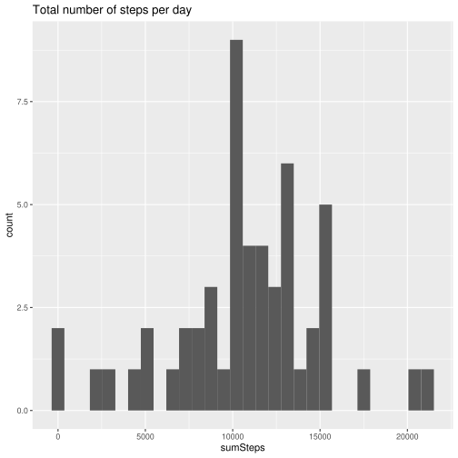
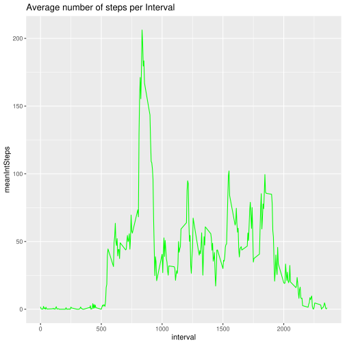
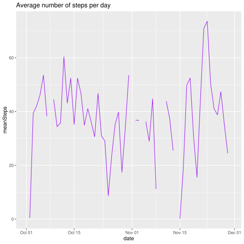
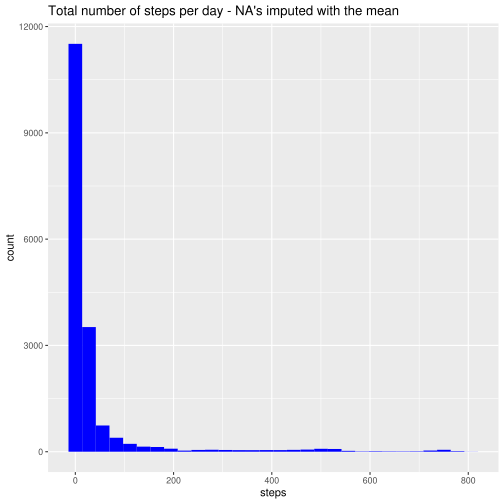
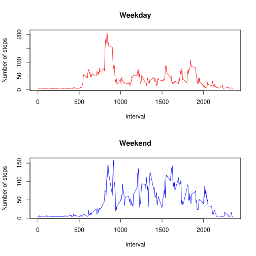

Introduction

It is now possible to collect a large amount of data about personal movement using activity monitoring devices such as a Fitbit, Nike Fuelband, or Jawbone Up. These type of devices are part of the “quantified self” movement – a group of enthusiasts who take measurements about themselves regularly to improve their health, to find patterns in their behavior, or because they are tech geeks. But these data remain under-utilized both because the raw data are hard to obtain and there is a lack of statistical methods and software for processing and interpreting the data.

This assignment makes use of data from a personal activity monitoring device. This device collects data at 5 minute intervals through out the day. The data consists of two months of data from an anonymous individual collected during the months of October and November, 2012 and include the number of steps taken in 5 minute intervals each day.

The data for this assignment can be downloaded from the course web site:

Dataset: Activity monitoring data [52K]
The variables included in this dataset are:

steps: Number of steps taking in a 5-minute interval (missing values are coded as \color{red}{\verb|NA|}NA)
date: The date on which the measurement was taken in YYYY-MM-DD format
interval: Identifier for the 5-minute interval in which measurement was taken
The dataset is stored in a comma-separated-value (CSV) file and there are a total of 17,568 observations in this dataset.


### Code for reading in the dataset and/or processing the data
#### Step 1: Read the file and assign it to a dataframe
#### Step 2:  Explore the data
##### Step 3:  count the NAs in the df

```r
library(readr)    
    #File URL -https://d396qusza40orc.cloudfront.net/repdata%2Fdata%2Factivity.zip
  
      setwd("~/Coursera - Data Science/Session 5 - Reproducible Research/Course Project 1")
        
    #Read the csv file
        activity <- read_csv("activity.csv", na = "NA")
```

```
## Parsed with column specification:
## cols(
##   steps = col_double(),
##   date = col_date(format = ""),
##   interval = col_double()
## )
```

```r
    #Explore the data
        str(activity)
```

```
## Classes 'spec_tbl_df', 'tbl_df', 'tbl' and 'data.frame':	17568 obs. of  3 variables:
##  $ steps   : num  NA NA NA NA NA NA NA NA NA NA ...
##  $ date    : Date, format: "2012-10-01" "2012-10-01" "2012-10-01" ...
##  $ interval: num  0 5 10 15 20 25 30 35 40 45 ...
##  - attr(*, "spec")=
##   .. cols(
##   ..   steps = col_double(),
##   ..   date = col_date(format = ""),
##   ..   interval = col_double()
##   .. )
```

```r
        head(activity)
```

```
## # A tibble: 6 x 3
##   steps date       interval
##   <dbl> <date>        <dbl>
## 1    NA 2012-10-01        0
## 2    NA 2012-10-01        5
## 3    NA 2012-10-01       10
## 4    NA 2012-10-01       15
## 5    NA 2012-10-01       20
## 6    NA 2012-10-01       25
```

```r
        summary(activity)
```

```
##      steps             date               interval     
##  Min.   :  0.00   Min.   :2012-10-01   Min.   :   0.0  
##  1st Qu.:  0.00   1st Qu.:2012-10-16   1st Qu.: 588.8  
##  Median :  0.00   Median :2012-10-31   Median :1177.5  
##  Mean   : 37.38   Mean   :2012-10-31   Mean   :1177.5  
##  3rd Qu.: 12.00   3rd Qu.:2012-11-15   3rd Qu.:1766.2  
##  Max.   :806.00   Max.   :2012-11-30   Max.   :2355.0  
##  NA's   :2304
```

```r
        #Count NA's
          sum(is.na(activity$steps))
```

```
## [1] 2304
```


### Histogram of the total number of steps taken each day  
#### Step 1:  Caclulate the total steps by day
#### Step 2:  plot the total steps by day

```r
    library(dplyr)
  
    #caclulate the total steps by day
        sumSteps <- activity %>%           # Specify original dataframe
            group_by(date) %>%             # Grouping variable(s)
            summarise(
              sumSteps = sum(steps),       # calculate sum of steps in activity
              )  ; sumSteps      
```

```
## # A tibble: 61 x 2
##    date       sumSteps
##    <date>        <dbl>
##  1 2012-10-01       NA
##  2 2012-10-02      126
##  3 2012-10-03    11352
##  4 2012-10-04    12116
##  5 2012-10-05    13294
##  6 2012-10-06    15420
##  7 2012-10-07    11015
##  8 2012-10-08       NA
##  9 2012-10-09    12811
## 10 2012-10-10     9900
## # … with 51 more rows
```

```r
    #plot the total steps by day
        library(ggplot2)
        ggplot(data = sumSteps, aes(sumSteps)) +
          ggtitle("Total number of steps per day") +
          geom_histogram()
```

```
## `stat_bin()` using `bins = 30`. Pick better value with `binwidth`.
```

```
## Warning: Removed 8 rows containing non-finite values (stat_bin).
```




### Mean and median number of steps taken each day
#### Step 1: Calulate the mean by day
#### Step 2: Calulate the median by day

```r
    #calulate the mean by day
        meanSteps <- activity %>%          # Specify original dataframe
            group_by(date) %>%             # Grouping variable(s)
            summarise(
              meanSteps = mean(steps),     # calculate mean of steps in activity
             ); meanSteps        
```

```
## # A tibble: 61 x 2
##    date       meanSteps
##    <date>         <dbl>
##  1 2012-10-01    NA    
##  2 2012-10-02     0.438
##  3 2012-10-03    39.4  
##  4 2012-10-04    42.1  
##  5 2012-10-05    46.2  
##  6 2012-10-06    53.5  
##  7 2012-10-07    38.2  
##  8 2012-10-08    NA    
##  9 2012-10-09    44.5  
## 10 2012-10-10    34.4  
## # … with 51 more rows
```

```r
    #calulate the median by day
        medianSteps <- activity %>%        # Specify original dataframe
            group_by(date) %>%             # Grouping variable(s)
            filter(steps > 0)  %>%         # Filter 0's or all the medians will be zero
            summarise(
              medianSteps = median(steps)  # calculate median of steps in activity
          ) ; medianSteps       
```

```
## # A tibble: 53 x 2
##    date       medianSteps
##    <date>           <dbl>
##  1 2012-10-02        63  
##  2 2012-10-03        61  
##  3 2012-10-04        56.5
##  4 2012-10-05        66  
##  5 2012-10-06        67  
##  6 2012-10-07        52.5
##  7 2012-10-09        48  
##  8 2012-10-10        56.5
##  9 2012-10-11        35  
## 10 2012-10-12        46  
## # … with 43 more rows
```


### Time series plot of the average number of steps taken
#### Step 1:  Calulate the mean steps by interval
#### Step 2:  Create the time series plot for mean Interval steps
#### Step 3:  Create the time series plot for mean steps


```r
  str(activity)
```

```
## Classes 'spec_tbl_df', 'tbl_df', 'tbl' and 'data.frame':	17568 obs. of  3 variables:
##  $ steps   : num  NA NA NA NA NA NA NA NA NA NA ...
##  $ date    : Date, format: "2012-10-01" "2012-10-01" "2012-10-01" ...
##  $ interval: num  0 5 10 15 20 25 30 35 40 45 ...
##  - attr(*, "spec")=
##   .. cols(
##   ..   steps = col_double(),
##   ..   date = col_date(format = ""),
##   ..   interval = col_double()
##   .. )
```

```r
  #calulate the mean steps by interval
    meanIntSteps <- activity %>%          # Specify original dataframe
            group_by(interval) %>%             # Grouping variable(s)
            summarise(
              meanIntSteps = mean(steps, na.rm = TRUE)     # calculate mean of steps in activity
             )        

  #Note there are some intervals where there were zero steps taken or NA Values
    ggplot(data = meanIntSteps, aes(x=interval, y=meanIntSteps)) +
      geom_line(color = "green") +
      ggtitle("Average number of steps per Interval") 
```



```r
  #Note there are some days where there were zero steps taken or NA Values
    ggplot(data = meanSteps, aes(x=date, y=meanSteps)) +
      geom_line(color = "purple") +
      ggtitle("Average number of steps per day") 
```

```
## Warning: Removed 2 rows containing missing values (geom_path).
```




### The 5-minute interval that, on average, contains the maximum number of steps
#### Step 1:  Sort the data descendng to get the max record at the top of the df
#### Step 2:  Select the first row of the sorted df

```r
        maxAveSteps <- arrange(meanIntSteps, desc(meanIntSteps))  #Sort to get the highest ave steps in the 1st row
        maxAveSteps[1, 1:2]                                       #Select the first row
```

```
## # A tibble: 1 x 2
##   interval meanIntSteps
##      <dbl>        <dbl>
## 1      835         206.
```


### Code to describe and show a strategy for imputing missing data
#### You can reference this article for an example on imputing NA values using the mean https://www.r-bloggers.com/2014/04/example-2014-5-simple-mean-imputation/

```r
        #Count NA's
        sum(is.na(activity$steps))
```

```
## [1] 2304
```

```r
        #Imputing values with the mean for the day
        #activityclean is a new dataset and does not include NAs
        activityclean = transform(activity, steps = ifelse(is.na(steps), 
                                        mean(steps, na.rm=TRUE), 
                                        steps))
```


### Histogram of the total number of steps taken each day after missing values are imputed

```r
      #plot the total steps by day
              library(ggplot2)
              ggplot(data = activityclean, aes(steps)) +
                ggtitle("Total number of steps per day - NA's imputed with the mean") +
                geom_histogram(fill = "blue")
```

```
## `stat_bin()` using `bins = 30`. Pick better value with `binwidth`.
```



```r
        #Note this skewed the data considerably  
```


### Panel plot comparing the average number of steps taken per 5-minute interval across weekdays and weekends
#### Step 1:  Get the weekday data
#### Step 2:  Get the weekend data
#### Step 3:  Create the panel plot

```r
activityclean$dayOfWeek <- ifelse(weekdays(activity$date) %in% c("Saturday", "Sunday"), "weekend", "weekday")

        #testing to determine if the the weekdays and weekends were added
        activityclean %>%          # Specify original dataframe
            group_by(dayOfWeek) %>%             # Grouping variable(s)
            summarise(
              sumSteps = sum(steps),     # calculate mean of steps in activity
             )       
```

```
## # A tibble: 2 x 2
##   dayOfWeek sumSteps
##   <chr>        <dbl>
## 1 weekday    461513.
## 2 weekend    195224.
```

```r
      #calulate the mean steps by interval filtered for weekdays
        weekdays <- activityclean %>% 
              filter(dayOfWeek == "weekday") %>% # Specify original dataframe
              group_by(dayOfWeek, interval) %>%             # Grouping variable(s)
              summarise(
              meanIntSteps = mean(steps, na.rm = TRUE)     # calculate mean of steps in activity
             )   

      #calulate the mean steps by interval filtered for weekend
        weekend <- activityclean %>% 
              filter(dayOfWeek == "weekend") %>% # Specify original dataframe
              group_by(dayOfWeek, interval) %>%             # Grouping variable(s)
              summarise(
              meanIntSteps = mean(steps, na.rm = TRUE)     # calculate mean of steps in activity
             )   

          
        par(mfrow = c(2,1))
              #Weekday plot
              plot(x=weekdays$interval, y=weekdays$meanIntSteps, type = "l", lty = 1,
                   ylab="Number of steps",
                   xlab = "Interval",
                   col = "red",
                   main = "Weekday")
              #Weekend plot
              plot(x=weekend$interval, y=weekend$meanIntSteps, type = "l", lty = 1,
                   ylab="Number of steps",
                   xlab = "Interval",
                   col = "blue",
                   main = "Weekend")
```




